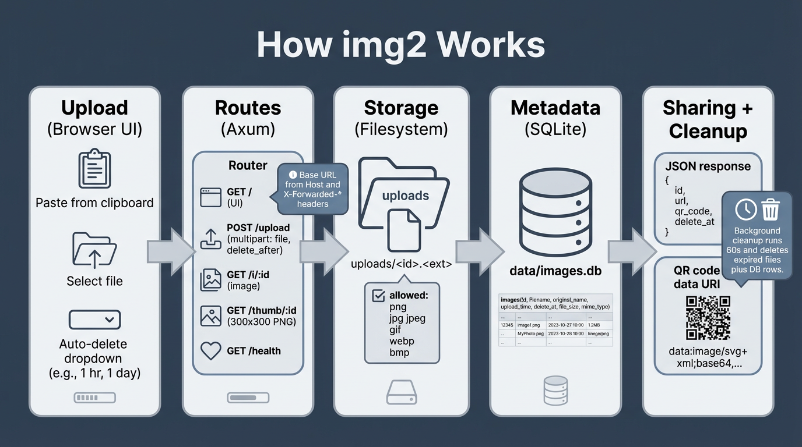
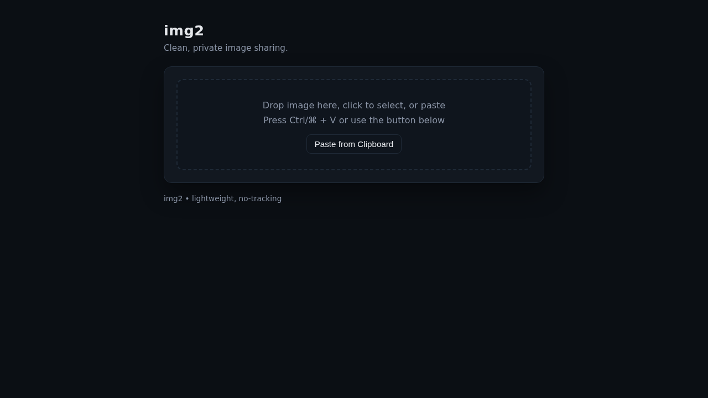
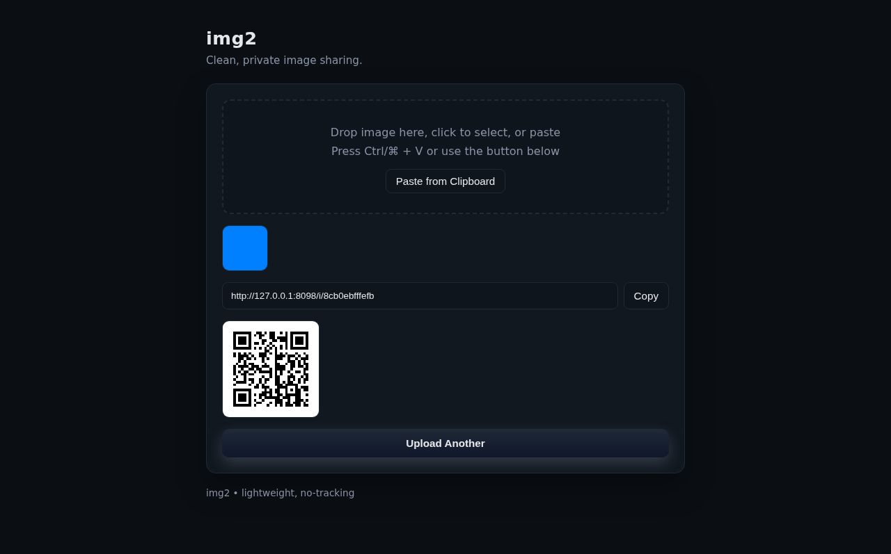

# img2

Minimal Rust image sharing service with clipboard paste, auto-delete, QR codes, and SQLite storage.

## Features
- Paste or upload images from the web UI
- Short links with thumbnails
- Optional auto-delete
- SQLite-backed metadata store
- QR code generation for easy sharing

## How It Works



### UI (Current Screens)

Home:



After upload (shows thumbnail, share URL, QR code, and auto-delete info):



## Build

```bash
cargo build --release
```

## Run

```bash
./run.sh
```

Environment overrides:
- `HOST` (default: 127.0.0.1)
- `PORT` (default: 8097)
- `UPLOAD_DIR` (default: ./uploads)
- `DB_PATH` (default: ./data/images.db)

## E2E Screenshots

1. Run the server:

```bash
./run.sh
```

2. Install Playwright (once per machine/CI image):

```bash
npm install
npx playwright install --with-deps chromium
```

3. Capture screenshots:

```bash
npm run shots
```

## E2E Tests

Assumes the server is already running.

```bash
npm run test:e2e
```

Optional override:
- `BASE_URL` (default: http://127.0.0.1:8097)

## Endpoints
- `/` UI
- `/upload` (POST multipart: `file`, `delete_after`)
- `/i/:id` image (stored file bytes)
- `/thumb/:id` thumbnail (300x300 PNG)
- `/health`

## Nginx
See `nginx-img2.bjk.ai.conf` for reverse proxy config (expects the app on `127.0.0.1:8097` by default).

## GitHub Push Notes
This repo excludes runtime data and build outputs via `.gitignore`:
- `target/`
- `data/`
- `uploads/`
- `*.db`
- `.env`
